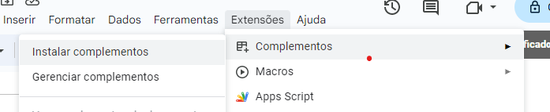

# `@emak-apps/certificados`

> Gerador de certificados para Casa Museu Ema Klabin

## Instalação

Navegue pelo menu "Extensões" > "Complementos" > "Instalar complementos"

É necessário ter o Google Cloud configurado.

### App Google cloud

1. Acesse o [Google Cloud Console](https://console.cloud.google.com/)
2. Crie um novo projeto
3. Configure a tela de autenticação
4. Adicione as apis: Google Drive, Google Sheets, Google Sheets

### Propriedades Google Apps-Scripts

- `app_range` - Range da planilha para as configurações do app
- `certificado_range` - Range da planilha para os certificados
- `atividade_range` - Range da planilha para a atividade
- `atividade_imagem_id` - Id da imagem da atividade
- `atividade_imagem_url` - Url da imagem da atividade
- `ministrantes_range_start` - Range da planilha para os ministrantes
- `participantes_range` - Range da planilha para os participantes
- `slide_template_url` - Url do slide template
- `slide_template_id` - Id do slide template
- `slide_folder_id` - Id da pasta onde os slides serão salvos
- `cert_app_started` - Se o app já foi iniciado
- `certificates_created` - Se os certificados já foram criados
- `clients_configured` - Se os clientes já foram adicionados
