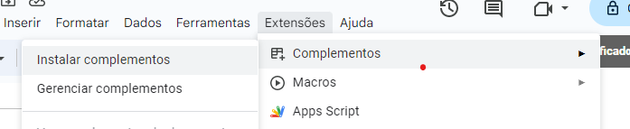

# `@ek-apps/pkg-certificados`

Gerador de certificados para Casa Museu Ema Klabin

## Instalação do usuário

Navegue pelo menu `Extensões > Complementos > Instalar complementos`

É necessário ter o Google Cloud configurado.

Nas opções do desenvolvedor estão definidas que o App Certificados só pode ser utilizado por Grupos organizacionais selecionados. Esta configuração pode ser alterada na [Lista de Aplicativos no Google Admin](https://admin.google.com/ac/apps/gmail/marketplace/apps)

## Configuração do desenvolvedor

### App Google cloud

1. Acesse o [Google Cloud Console](https://console.cloud.google.com/)
2. Crie um novo projeto
3. Configure a tela de autenticação
4. Adicione as APIs: Google Drive, Google Sheets, Google Slide, e Google Workspace Marketplace SDK

### Propriedades Google Apps-Scripts

- `app_range` - Range da planilha para as configurações do app
- `certificado_range` - Range da planilha para os certificados
- `atividade_range` - Range da planilha para a atividade
- `atividade_imagem_id` - Id da imagem da atividade
- `atividade_imagem_url` - Url da imagem da atividade
- `ministrantes_range_start` - Range da planilha para os ministrantes
- `participantes_range` - Range da planilha para os participantes
- `slide_template_url` - Url do slide template
- `slide_template_id` - Id do slide template
- `slide_folder_id` - Id da pasta onde os slides serão salvos
- `cert_app_started` - Se o app já foi iniciado
- `certificates_created` - Se os certificados já foram criados
- `clients_configured` - Se os clientes já foram adicionados

### Deploy

1. Realize um novo deploy do projeto do tipo `Add-on` no menu `Deploy` > `New deploy`
2. Utiliza a versão do `package.json` como descrição da versão do deploy, o apps-script irá gerar seu próprio versionamento, utilize este número na configuração do app no Google Admin
3. Vá até a aba `Configurações do APP` no [link](https://console.cloud.google.com/apis/api/appsmarket-component.googleapis.com/)
   1. Em `Integração de apps` selecione `Complemento do Planilhas`
   2. Insira a ID do Apps script no campo `ID do script do projeto de complementos do Planilhas`
   3. Insira o número da versão do deploy no campo `Versão do script de complementos do Planilhas`
   4. Salve as alterações
   5. Teste o app. Se tudo estiver correto, o app estará disponível para instalação no Google Admin
